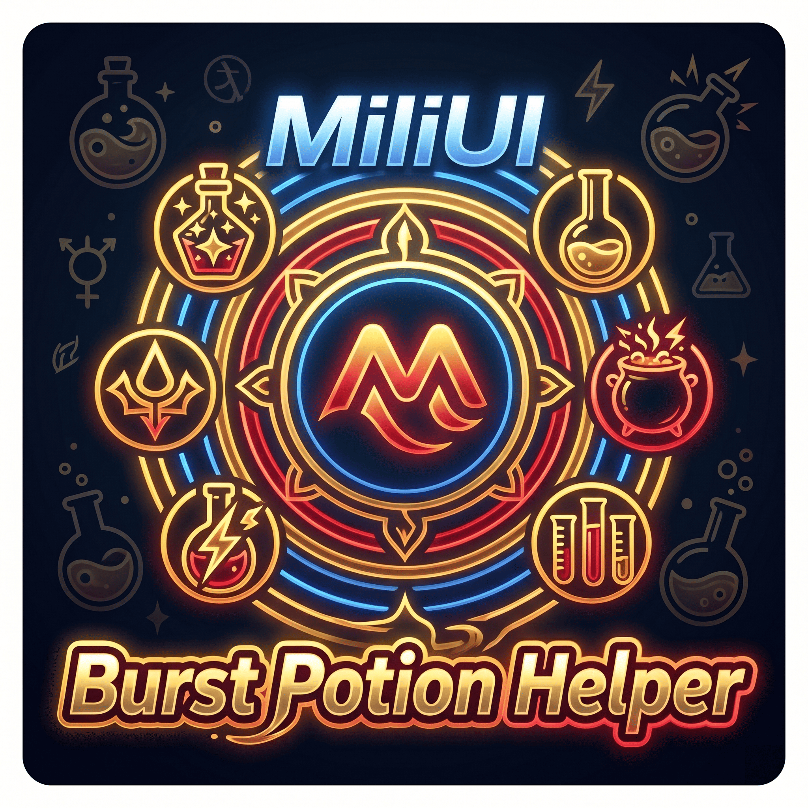

# MiliUI Burst Potion Helper

A World of Warcraft addon that lets you switch your burst combat potion (and its quality) from a tiny bar, then drink it with a single macro. Switching works in combat without taint or secret-value errors.



## Features

- Switch your burst potion and quality from a small movable bar
- One macro for everything: `/click MiliUIBurstButton`
- Combat-safe: switch potions mid-fight without taint or secret-value errors
- Built-in potions kept up to date (Light's Potential, Potion of Recklessness, Draught of Rampant Abandon), with quality variants
- Optional right-click an icon to drink that potion directly
- Cooldown swirl and item tooltips on the icons
- Add your own potions by item ID or Shift-click, and restore defaults anytime
- Lockable / collapsible bar
- Localization: English, 繁體中文, 简体中文

## Installation

1. Download the latest release ZIP
2. Extract to `World of Warcraft\_retail_\Interface\AddOns\`
3. Restart the game or `/reload`

## Usage

1. Add this one line to your burst macro:
   ```
   /click MiliUIBurstButton
   ```
2. Left-Click a potion on the bar to choose which one (and which quality) the macro drinks.
3. Open settings with `/mbh` or `/bursthelper`, or `Esc` → `Options` → `AddOns` → `Burst Potion Helper`.

### Slash commands

- `/mbh` or `/bursthelper` — open settings
- `/mbh macro` — copy the macro command
- `/mbh show` / `/mbh hide` — show or hide the bar
- `/mbh reset` — reset the bar position

## Adding Custom Potions

1. Open the settings panel and go to the Potion list
2. Click **Add potion**, then type an item ID or Shift-click an item in your bags / chat

## Acknowledgements

Special thanks to **爆发药水切换 (BurstPotionSwitcher)** for the inspiration.

---

# MiliUI 爆發藥水助手

一個《魔獸世界》插件，讓你用一條小列切換爆發藥水（與品質），再用單一巨集喝下。戰鬥中切換不會觸發污染或秘密值錯誤。


## 功能

- 用可拖曳的小快捷列切換爆發藥水與品質
- 一個巨集搞定一切：`/click MiliUIBurstButton`
- 戰鬥安全：戰鬥中也能切換藥水，不觸發污染與秘密值錯誤
- 內建藥水持續更新（潛能聖水、魯莽藥水、猛烈捨棄藥劑），包含各種品質
- 可選右鍵點圖示直接喝下該藥水
- 圖示上顯示冷卻轉圈與物品提示
- 可用物品 ID 或 Shift 點擊新增自訂藥水，並可隨時還原預設
- 可鎖定／可收合的列

- 多語系：English、繁體中文、简体中文

## 安裝

1. 下載最新版本的 ZIP 檔案
2. 解壓縮至 `World of Warcraft\_retail_\Interface\AddOns\`
3. 重新啟動遊戲或 `/reload`

## 使用方式

1. 在你的爆發巨集加入這一行：
   ```
   /click MiliUIBurstButton
   ```
2. 左鍵點擊快捷列上的藥水，選擇喝哪一種（與哪個品質）。
3. 用 `/mbh` 或 `/bursthelper` 開啟設定，或 `Esc` → `選項` → `插件` → `爆發藥水助手`。

### 斜線指令

- `/mbh` 或 `/bursthelper` — 開啟設定
- `/mbh macro` — 複製巨集指令
- `/mbh show` / `/mbh hide` — 顯示或隱藏列
- `/mbh reset` — 重設列的位置

## 新增自訂藥水

1. 開啟設定面板，前往「藥水清單」
2. 點擊 **新增藥水**，輸入物品 ID 或在背包／聊天中 Shift 點擊物品

## 特別感謝

特別感謝 **爆发药水切换 (BurstPotionSwitcher)** 給予的靈感與啟發。

---

Author: Mili
